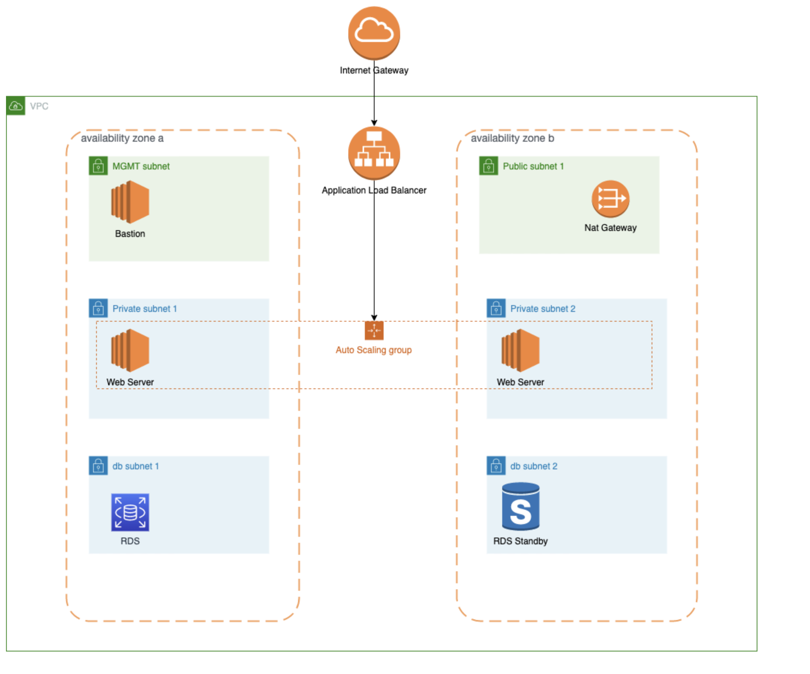

# Terraform AWS 3-Tier

## 생성되는 리소스
* VPC
* Subnet
* RouteTable
* EIP
* Internet Gateway
* SecurityGroup
* Nat Gateway
* EC2 (bastion)
* Auto Scaling Group
* Application Load Balancer
* RDS

## TODO
* 모듈화
* Internal LB 추가 (WAS)
